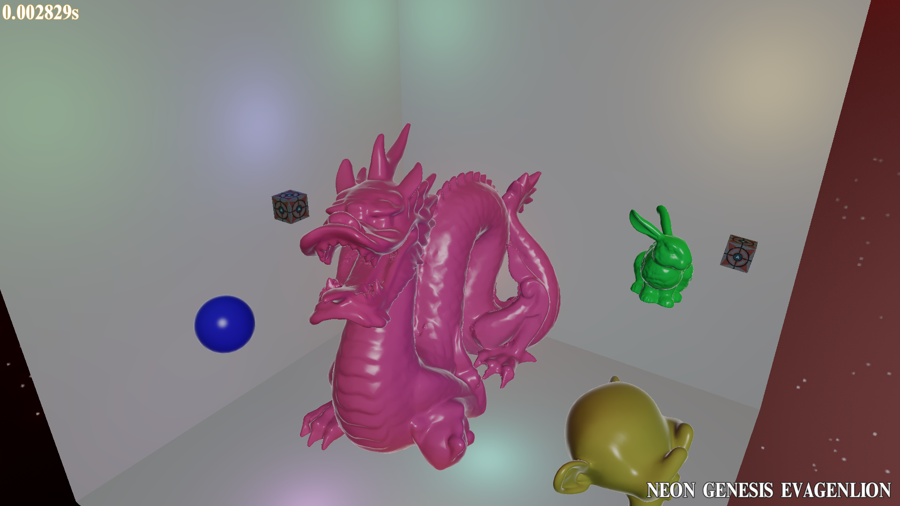

# Vulkan Game Dev README

A cross-platform game engine created with Vulkan Api and c++.
For windows and android only. Note: I am still learning, dun expect perfection pls

# Building
all the source codes, external libraries, assets and android mk files are in the repo.

# Visual Studio
- In order to build in debug mode, you may need to download and install the latest VulkanSDK from https://vulkan.lunarg.com/ 
- I am using visual studio community 2015
- shld have no problem when building release mode

# Android Studio
- Android studio 2.2 or above is required for android builds.
- latest Ndk is required, download it from sdk (if dont have it)
- Build only support arm64-v8a
- Important: You need to have a device with an Android image that supports Vulkan

# Current engine Features
- Multiplatform friendly : Settle platform specific codes such as creating windows and handling inputs/events. 
  
- Multithreaded environment : input && game loop concurrently running in its own threads. In game loop, when rendering the previous framepacket, at the same time, updating the next framepacket. Also, thanks to vulkan, I can record command buffers concurrently too
  
- Deferred Shading Rendering Graphics pipeline: no more forward rendering
  
- Various Post-Processing effects : currently only hdr, gamma correction, tone mapping are implemented. (in future will have ssao, motion blur, lens flare etc)
  
- Entity-Component Architecture

- Basic UI, Signed Distance Fields Fonts

# Credits
- SaschaWillems for his wonderful vulkan example https://github.com/SaschaWillems/Vulkan
- Vulkan details Specs and tutorials in VulkanLunarSDK https://vulkan.lunarg.com/
- Superb Beginner guide https://vulkan-tutorial.com/

# my youtube channel $$$$
https://www.youtube.com/channel/UCCMgDJDAyT-KhGlrr5qMZPQ

subscribe for more videos about vulkan api in the future :))

